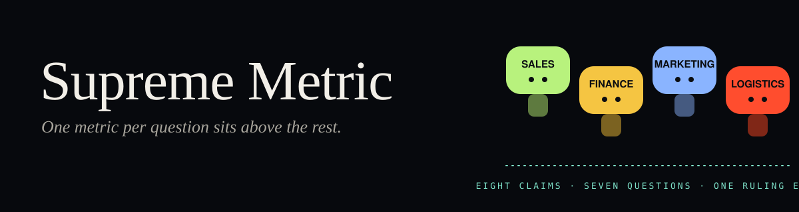

<p align="center"></p>

<p align="center"><b>One metric per question sits above the rest.</b><br>
Supreme Metric is the standard a number has to pass before it is allowed to answer a business question.<br>
It never computes a number. It decides whether a number may speak.</p>

<p align="center">
<a href="https://yanqing.app/supreme-metric"><b>See it in motion</b></a> ·
<a href="AGENTS.md"><b>Stand it up with an agent</b></a> ·
<a href="spec/SPEC.md">Read the spec</a>
</p>

---

## The meeting

> **SALES** · Sales are up 14%. · Share is up 1.8 pts.
> **FINANCE** · Margin is flat. · Forecast says a softer Q4.
> **MARKETING** · Impression share is 5.4 pts down. · New shoppers are up.
> **LOGISTICS** · Inventory is piling up. · Shipped items are blocked.

Every claim is true. Every claim is reproducible. Nobody can answer *"How's my business performance?"*

Now the same eight claims arrive from an AI assistant, in a second, with confidence. The problem did not go away. It got faster.

## Three rules

1. **Every question has one score.** One metric carries the verdict. Every other number is a companion or a diagnostic. It may explain the verdict; it may not recolor it.
2. **Every answer is reviewed before it ships.** A page lists the numbers it wants to show. A linter checks each one against the standard. A number that fails does not appear.
3. **Every metric has one owner.** Somebody signs the definition and explains the number. Changing it is a pull request that the owner approves.

That is the whole product. The rules live in a folder of small YAML files, in git, next to your code.

## The tree

```mermaid
flowchart TD
  T([Business performance]):::topic
  T --> Q1["Are we growing?"]:::sales
  T --> Q2["Are we winning?"]:::sales
  T --> Q3["Are we growing profitably?"]:::finance
  T --> Q4["Will it hold next quarter?"]:::finance
  T --> Q5["Are we capturing search demand?"]:::marketing
  T --> Q6["Are we recruiting customers?"]:::marketing
  T --> Q7["Can we serve the demand?"]:::logistics
  Q1 ==> M1["Net sales, consumption"]:::sales
  Q1 -.-> M8["Net sales, shipped"]:::finance
  Q2 ==> M2["Market share"]:::sales
  Q2 -.-> M9["Share of category growth"]:::marketing
  Q3 ==> M3["Contribution margin"]:::finance
  Q3 -.-> M10["Cost to serve"]:::logistics
  Q4 ==> M4["Forecast vs. target"]:::finance
  Q4 -.-> M11["Open order backlog"]:::sales
  Q5 ==> M5["Search impression share"]:::marketing
  Q5 -.-> M12["Search click share"]:::marketing
  Q6 ==> M6["New-to-brand customers"]:::marketing
  Q6 -.-> M13["New shopper rate"]:::sales
  Q7 ==> M7["Inventory weeks of cover"]:::logistics
  Q7 -.-> M14["Fill rate"]:::logistics
  classDef topic fill:#0E1218,stroke:#7DE0C8,color:#F2EFE8
  classDef sales fill:#1D2A12,stroke:#B8F27D,color:#F2EFE8
  classDef finance fill:#2C2410,stroke:#F5C542,color:#F2EFE8
  classDef marketing fill:#141F36,stroke:#8AB4FF,color:#F2EFE8
  classDef logistics fill:#331510,stroke:#FF4D2E,color:#F2EFE8
```



Thick line: the score. Dotted line: the companion. Color: the team that owns the verdict. Nothing here is drawn by hand. `supreme compile` derives it from the seven question files in [`registry/questions/`](registry/questions).

## Stand it up with an agent

You do not have to learn the file formats. Point a coding agent at this repo and let it do the authoring while you approve the meaning.

Paste this into Claude Code, Codex, Cursor, or the Databricks Assistant:

> Read `AGENTS.md` in https://github.com/Yanqing-Jiang/supreme-metric and stand up Supreme Metric as the metric-topology layer for my **sales team** on **Azure Databricks**. Databricks CLI profile `sales`, SQL warehouse `<id>`, catalog `<catalog>`, schema `<schema>`. Start with one business question. Ask me before you name an owner, pick a score metric, or approve a fingerprint.

| The agent does | You approve |
|---|---|
| Lists the tables and metric views it is allowed to see | The question to start with |
| Proposes metrics grounded in what exists, with definition, grain, window, benchmark | Who owns each metric |
| Drafts the question, its score and companion, and the ruling that says why | The score and companion assignment |
| Compiles, validates, wires CODEOWNERS and CI, emits and lints the first report | The implementation fingerprint that becomes the baseline |

The agent never invents a metric without a source, never assigns two scores to one question, and never blesses a live definition without you. The rules it follows are in [`AGENTS.md`](AGENTS.md). The step-by-step runbook is in [`docs/agent-standup.md`](docs/agent-standup.md), with the Azure Databricks specifics in [`docs/azure-databricks.md`](docs/azure-databricks.md).

## By hand, five minutes

```bash
pip install "supreme-metric[schema,databricks] @ git+https://github.com/Yanqing-Jiang/supreme-metric"

git clone https://github.com/Yanqing-Jiang/supreme-metric && cd supreme-metric
supreme compile registry --out dist/topology.json
supreme lint fixtures/clean/pack.yaml --topology dist/topology.json
supreme lint fixtures/invalid/MT041-wow-benchmark.yaml --topology dist/topology.json
```

The first lint passes. The second fails with one line: a week-over-week benchmark is not allowed on the leadership surface, and here is the ruling that says so.

## What you get

**A registry in git.** Three kinds of files and one profile. The profile names your vocabulary: owners, surfaces, windows, benchmarks. Nothing in the tool knows what `p4w` means or how many questions you have.

| file | says |
|---|---|
| `questions/<id>.yaml` | one business question, its score metric, its companions, what is prohibited |
| `metrics/<owner>.yaml` | the metrics one team owns: definition, grain, allowed windows and benchmarks, where it is implemented |
| `rulings/<owner>/RULING-….yaml` | a dated decision and the reason, append-only |

**One command-line tool.**

| command | does |
|---|---|
| `supreme init` | scaffolds a registry from an approved profile |
| `supreme validate` | checks every file against the published JSON Schemas |
| `supreme compile` | derives the topology and a digest that pins it |
| `supreme inspect databricks` | lists tables and metric views in one catalog and schema, read-only |
| `supreme sync databricks` | verifies each metric's implementation: verified, drifted, or unverifiable |
| `supreme pack` | turns an annotated Markdown report into a claim pack |
| `supreme lint` | checks a claim pack and reports findings as text, JSON, or GitHub annotations |

**An approval workflow you already have.** `CODEOWNERS` points at the owner of each metric file. A pull request is the review. CI runs the linter. The ruling is the record.

## What it is not

**Not Atlan.** No crawler, no lineage, no access control. It catalogs only what a page is allowed to say.
**Not dbt MetricFlow or Cube.** It does not define joins, compute, cache, or serve a metric. Databricks stays the semantic layer that computes; Supreme Metric is the topology layer that governs.
**Not a BI tool.** No charts. It runs before the chart.

## Status

| | |
|---|---|
| **M1** | spec, neutral profile, reference registry, `supreme compile` with a stable digest ✓ |
| **M2** | claim-pack linter, negative fixtures for every finding code, CI, CODEOWNERS flow ✓ |
| **M3** | `supreme inspect databricks` and `supreme sync databricks`, read-only, fixture-tested ✓ · live smoke test against a real workspace pending |
| **M4** | `supreme pack` from annotated Markdown ✓ · agent runbook and JSON Schemas ✓ · [landing page](https://yanqing.app/supreme-metric) ✓ |
| **Next** | dbt metric verification, source locations in every finding, SARIF output |

Sync verifies that a metric view's definition is the one the owner approved. It does not prove the number is right. Nothing here does.

## License

Apache-2.0
